# Eragear Obsidian Copilot

## 1. Tổng Quan Điều Hành: Định Hình Lại Mối Quan Hệ Giữa Trí Tuệ Nhân Tạo và Tri Thức Cá Nhân

Trong bối cảnh bùng nổ của kỷ nguyên thông tin, việc quản lý tri thức cá nhân (Personal Knowledge Management - PKM) không còn đơn thuần là việc lưu trữ dữ liệu tĩnh. Nó đã chuyển mình thành một hệ sinh thái động, nơi tri thức cần được "nuôi dưỡng", kết nối và tái sinh liên tục.
=> Dự án tích hợp giữa Obsidian—một công cụ "Second Brain" hoạt động theo nguyên lý local-first—và Eragear—một ứng dụng AI chat tiên tiến triển khai trên hạ tầng Cloudflare—đại diện cho một bước nhảy vọt trong kiến trúc phần mềm cộng tác giữa người và máy (Human-AI Symbiosis).

Báo cáo này được xây dựng dựa trên yêu cầu cốt lõi về việc thiết lập một mối quan hệ tiến bộ chung, nơi Eragear đóng vai trò là tác nhân trí tuệ nhân tạo (AI Agent) có khả năng đọc, hiểu và làm giàu tri thức của người dùng mà không xâm phạm quyền chủ quyền dữ liệu. Khác biệt hoàn toàn với các mô hình SaaS truyền thống yêu cầu đồng bộ hóa toàn bộ dữ liệu lên đám mây, kiến trúc được đề xuất tuân thủ nghiêm ngặt nguyên tắc "**Zero-Data-Retention**" (Không lưu trữ dữ liệu) tại phía máy chủ. Thay vào đó, nó áp dụng cơ chế "**Just-in-Time Context Injection**" (Tiêm ngữ cảnh đúng thời điểm), cho phép AI truy cập và xử lý dữ liệu ngay tại thời điểm cần thiết thông qua các API bảo mật, sau đó giải phóng tài nguyên ngay lập tức.

Trọng tâm của nghiên cứu này xoay quanh việc khai thác sâu Obsidian Plugin API để biến đổi cấu trúc đồ thị (Graph View) của các ghi chú thành dữ liệu có cấu trúc mà Large Language Models (LLMs) có thể suy luận được. Đồng thời, báo cáo đề xuất các giải pháp kỹ thuật cụ thể cho quy trình "Human-in-the-Loop" (Con người trong vòng lặp), đảm bảo người dùng luôn nắm quyền kiểm soát cuối cùng thông qua các giao diện so sánh (Diff View) trực quan và cơ chế phê duyệt minh bạch.

## 2. Nền Tảng Lý Thuyết và Kiến Trúc Hệ Thống

### 2.1. Triết Lý "Second Brain" và Mạng Lưới Tri Thức

Khái niệm "Second Brain", được phổ biến bởi Tiago Forte và cộng đồng PKM, nhấn mạnh việc ngoại vi hóa trí nhớ sinh học sang các hệ thống kỹ thuật số đáng tin cậy. Obsidian, với cấu trúc dựa trên các tệp Markdown liên kết đôi (bi-directional links), hiện thực hóa mô hình này dưới dạng một đồ thị tri thức (Knowledge Graph). Mỗi ghi chú là một nút (node), và mỗi liên kết là một cạnh (edge), tạo nên một cấu trúc mạng lưới phản ánh tư duy phi tuyến tính của con người.

Đối với Eragear, giá trị không nằm ở từng ghi chú riêng lẻ mà nằm ở mối quan hệ giữa chúng. Khả năng "Context Engineering" của Eragear phụ thuộc vào việc giải mã cấu trúc đồ thị này. Nếu AI có thể hiểu được rằng ghi chú A liên kết với ghi chú B, và ghi chú B mâu thuẫn với ghi chú C, nó có thể cung cấp các phân tích sâu sắc hơn nhiều so với việc chỉ tìm kiếm từ khóa đơn thuần. Đây là nền tảng của **GraphRAG** (Retrieval-Augmented Generation trên đồ thị), một kỹ thuật tiên tiến cho phép LLM suy luận dựa trên cấu trúc topo của dữ liệu.

### 2.2. Kiến Trúc Hybrid: Local Intelligence và Cloud Reasoning

Để đáp ứng yêu cầu về tính độc lập dữ liệu và không tạo bản sao trên máy chủ, hệ thống phải áp dụng kiến trúc Hybrid RAG.
**Bảng 1: Phân Chia Trách Nhiệm Xử Lý trong Kiến Trúc Hybrid**

| Thành Phần          | Vị Trí Triển Khai  | Trách Nhiệm Chính                                                                 | Công Nghệ Cốt Lõi                                           |
| :------------------ | :----------------- | :-------------------------------------------------------------------------------- | :---------------------------------------------------------- |
| **Obsidian Plugin** | Local (Electron)   | Quản lý Metadata, Indexing, Vector Embedding cục bộ, Giao diện UI/UX (Diff View). | Obsidian API, TypeScript, React, Web Workers                |
| **Eragear Core**    | Cloudflare Workers | Xử lý ngôn ngữ tự nhiên (NLP), Suy luận logic, Context Assembly, API Gateway.     | Cloudflare Workers, Hono/Itchy, LLM APIs (OpenAI/Anthropic) |
| **Communication**   | Secure Tunnel      | Truyền tải ngữ cảnh mã hóa, Xác thực bảo mật.                                     | HTTPS, Cloudflare Access, Service Tokens, mTLS              |

Trong mô hình này, plugin Obsidian đóng vai trò là "người gác cổng" (Gatekeeper). Nó chịu trách nhiệm chuẩn bị dữ liệu: trích xuất văn bản, phân tích liên kết. Eragear trên Cloudflare chỉ nhận dữ liệu đã được xử lý sơ bộ (pre-processed context) cho một phiên chat cụ thể, thực hiện suy luận, và trả về kết quả.

### 2.3. Nguyên Tắc "Just-in-Time" và Quyền Riêng Tư

Kiến trúc "Just-in-Time" (JIT) RAG là chìa khóa để giải quyết mâu thuẫn giữa sức mạnh của Cloud AI và quyền riêng tư dữ liệu. Khi người dùng đặt câu hỏi, hệ thống thực hiện các bước sau:

1. **Local Retrieval**: Plugin tìm kiếm cục bộ các ghi chú liên quan nhất.

2. **Encryption (optional) & Transmission**: Dữ liệu được mã hóa và gửi lên Eragear chỉ cho request đó.

3. **Inference**: Eragear xử lý trong bộ nhớ (in-memory) của Worker.

4. **Destruction(optional)**: Ngay sau khi phản hồi được gửi đi, dữ liệu trong bộ nhớ Worker bị hủy bỏ. Cloudflare Workers có đặc tính "ephemeral" (ngắn hạn), hỗ trợ tốt cho mô hình này.

## 3. Phân Tích Chuyên Sâu Obsidian Plugin API

Để Eragear hoạt động như một thành phần hữu cơ của Obsidian, việc hiểu rõ và khai thác triệt để API của Obsidian là bắt buộc. Đây không chỉ là việc đọc tài liệu, mà là hiểu về vòng đời ứng dụng (App Lifecycle) và cơ chế quản lý bộ nhớ đệm (Caching).

### 3.1. MetadataCache: Hệ Thần Kinh Của Vault

`MetadataCache` là thành phần quan trọng nhất cho bất kỳ plugin nào muốn hiểu cấu trúc liên kết của Obsidian. Nó cung cấp một bản đồ thời gian thực về tất cả các liên kết trong kho dữ liệu (Vault).

#### 3.1.1. Cấu Trúc `resolvedLinks` và `unresolvedLinks`

API cung cấp thuộc tính `resolvedLinks`, là một đối tượng lồng nhau (nested dictionary) ánh xạ đường dẫn tệp nguồn tới các tệp đích:

```typescript
resolvedLinks: Record<string, Record<string, number>>;
```

- Key cấp 1: Đường dẫn của file chứa liên kết (Source).

- Key cấp 2: Đường dẫn của file được liên kết (Target).

- Value: Số lần liên kết xuất hiện trong file.

Ngược lại, `unresolvedLinks` chứa các liên kết trỏ đến các file chưa tồn tại. Đây là nguồn dữ liệu quý giá cho Eragear để đề xuất "làm giàu" tri thức: AI có thể quét các `unresolvedLinks` và gợi ý người dùng tạo file mới với nội dung được dự thảo sẵn.

#### 3.1.2. Chiến Lược Lắng Nghe Sự Kiện (Event Handling)

Obsidian là một ứng dụng hướng sự kiện. Việc cập nhật đồ thị tri thức cho Eragear phải dựa trên sự kiện để đảm bảo hiệu năng.

- `on('resolve')`: Được kích hoạt khi một file được index xong. Đây là thời điểm an toàn để Eragear cập nhật lại đồ thị cục bộ của nó.

- `on('changed')`: Kích hoạt khi nội dung file thay đổi. Cần lưu ý rằng sự kiện này bắn ra rất nhanh khi người dùng gõ phím. Việc xử lý trực tiếp sự kiện này sẽ gây lag editor.

- **Kỹ thuật Debouncing**: Bắt buộc phải áp dụng kỹ thuật Debounce (trì hoãn xử lý) khoảng 500ms-2000ms sau sự kiện `changed` cuối cùng trước khi kích hoạt quy trình phân tích của AI, để đảm bảo tài nguyên hệ thống không bị lãng phí.

### 3.2. Truy Xuất Dữ Liệu và Quản Lý Tệp (File Management)

API Vault cung cấp các phương thức để đọc và ghi dữ liệu.

- `vault.read(file: TFile)`: Đọc nội dung file dưới dạng string.

- `vault.modify(file: TFile, data: string)`: Ghi đè nội dung file. Đây là phương thức nguy hiểm cần được kiểm soát chặt chẽ bởi quy trình Human-in-the-Loop.

- `vault.cachedRead(file: TFile)`: Một phương thức tối ưu hơn, trả về phiên bản cache của file nếu nó chưa thay đổi, giúp giảm tải I/O đĩa cứng khi Eragear cần quét qua hàng nghìn ghi chú để tìm ngữ cảnh.

### 3.3. Vấn Đề Hiệu Năng và Web Workers

Một trong những thách thức lớn nhất khi tích hợp AI vào Obsidian là hiệu năng. Obsidian chạy trên Electron, và luồng chính (Main Thread) chịu trách nhiệm cho cả việc render giao diện và xử lý logic JavaScript. Nếu plugin thực hiện các tác vụ nặng như tính toán vector embedding hoặc tìm kiếm chuỗi phức tạp (Aho-Corasick) trên luồng chính, giao diện sẽ bị đơ (freeze).

Giải pháp bắt buộc là sử dụng **Web Workers**. Web Worker cho phép chạy mã JavaScript trên một luồng nền (background thread), tách biệt hoàn toàn với luồng giao diện.

- **Triển khai**: Plugin cần đóng gói logic xử lý AI, files, notes vào một file worker riêng biệt.

- **Giao tiếp**: Sử dụng cơ chế `postMessage` để gửi văn bản từ plugin xuống worker và nhận lại kết quả ( danh sách mention).

- **Cấu hình Bundler**: Việc tích hợp Web Worker vào plugin Obsidian đòi hỏi cấu hình `esbuild` đặc biệt (sử dụng plugin `esbuild-plugin-inline-worker` hoặc tương tự) để inline mã worker vào file `main.js` hoặc load nó như một blob URL, do Obsidian không hỗ trợ load file worker từ đường dẫn tương đối một cách tự nhiên trong môi trường mobile.

## 4. Context Engineering và GraphRAG

Eragear chú trọng vào **Context Engineering**, và trong bối cảnh Obsidian, điều này đồng nghĩa với việc chuyển đổi cấu trúc Markdown/Graph thành định dạng mà LLM có thể hiểu sâu sắc nhất.

### 4.1. Từ Văn Bản đến Cấu Trúc Đồ Thị JSON

LLM không thể "nhìn" thấy Graph View của Obsidian. Chúng ta cần tuần tự hóa (serialize) nó. Các nghiên cứu gần đây về GraphRAG chỉ ra rằng biểu diễn đồ thị dưới dạng danh sách kề (Adjacency List) thường mang lại hiệu quả suy luận tốt hơn cho LLM so với danh sách cạnh (Edge List) đối với các tác vụ định hướng cấu trúc.

**Đề xuất Schema JSON cho Context**:

```json
{
  "context_id": "session_123",

  "focal_node": "Design Patterns.md",

  "graph_structure": {
    "nodes": [
      {
        "id": "n1",

        "label": "Design Patterns",

        "content_summary": "...",

        "tags": ["#programming"]
      },

      {
        "id": "n2",

        "label": "Singleton Pattern",

        "content_summary": "Đảm bảo class chỉ có một instance...",

        "tags": ["#pattern"]
      }
    ],

    "adjacency": {
      "n1": ["n2"],

      "n2": []
    }
  }
}
```

Cấu trúc này cho phép Eragear hiểu được không chỉ nội dung mà còn cả vị trí topo học của ghi chú. Việc bao gồm `content_summary` thay vì toàn bộ nội dung giúp tiết kiệm token cửa sổ ngữ cảnh (Context Window).

### 4.2. Chiến Lược Thu Thập Ngữ Cảnh (Retrieval Strategy)

Để xây dựng đồ thị JSON trên, plugin cần thực hiện thuật toán tìm kiếm lai (Hybrid Search):

1. **Keyword Search**: Tìm các ghi chú chứa từ khóa chính trong câu hỏi của người dùng.

2. **Vector Search (Semantic)**: Sử dụng embeddings (tạo bởi `transformers.js` trong Web Worker) để tìm các ghi chú có ý nghĩa tương đồng nhưng khác từ ngữ.

3. **Graph Traversal**: Từ các ghi chú tìm được ở bước 1 và 2 (gọi là **Seed Nodes**), thực hiện thuật toán lan truyền (như BFS - Breadth-First Search) để lấy thêm các ghi chú lân cận (k-hop neighbors, thường là k=1 hoặc k=2). Điều này cung cấp ngữ cảnh "xung quanh" vấn đề, giúp AI hiểu được bối cảnh rộng hơn.

### 4.3. Prompt Engineering cho Graph Reasoning

Khi gửi dữ liệu lên Eragear, prompt hệ thống (System Prompt) cần được thiết kế để hướng dẫn LLM cách "đọc" cấu trúc JSON này. Kỹ thuật "Chain-of-Thought" (CoT) nên được áp dụng để kích thích khả năng suy luận đồ thị của mô hình.

Ví dụ Prompt:

> "Bạn được cung cấp một đồ thị tri thức dưới định dạng JSON bao gồm danh sách các node và danh sách kề (adjacency list). Hãy phân tích mối quan hệ giữa node trung tâm và các node lân cận. Hãy xác định xem có bất kỳ mâu thuẫn nào giữa nội dung của 'Node A' và 'Node B' không, dựa trên các liên kết đã cung cấp."

## 5. Kỹ Thuật "Làm Giàu" Tri Thức (Enrichment)

Mục tiêu của Eragear không chỉ là trả lời, mà còn là đóng góp ngược lại vào Obsidian.

## 6. Giao Diện Human-in-the-Loop: Kiểm Soát và Hợp Tác

Để tuân thủ yêu cầu "User hoàn toàn control", giao diện người dùng đóng vai trò quyết định. AI không bao giờ được phép âm thầm sửa đổi dữ liệu.

### 6.1. React Diff Viewer và Shadow DOM

Khi Eragear đề xuất thay đổi nội dung (ví dụ: viết lại một đoạn văn, thêm một section mới), plugin cần hiển thị sự khác biệt một cách trực quan.

- **Thư viện**: Sử dụng `react-diff-viewer` để hiển thị so sánh side-by-side (bên cạnh nhau) hoặc inline (trong dòng) giữa văn bản gốc và văn bản đề xuất.

- **Shadow DOM**: Một vấn đề kỹ thuật lớn khi nhúng React components vào Obsidian là xung đột CSS. CSS của theme Obsidian có thể phá vỡ giao diện của component React. Việc bọc component `react-diff-viewer` vào trong Shadow DOM (`root.attachShadow({mode: 'open'})`) giúp cô lập hoàn toàn style của nó, đảm bảo hiển thị đúng như thiết kế bất kể người dùng đang cài theme gì.

### 6.2. Quy Trình Review-Approve-Merge

Quy trình tương tác được thiết kế như sau:

1. **AI Suggestion**: Eragear gửi về một bản vá (patch) hoặc nội dung mới.

2. **Preview**: Plugin hiển thị Diff View trong một modal hoặc sidebar.

3. **Interaction**: Người dùng có thể:

- _Accept_: Áp dụng toàn bộ thay đổi.

- _Reject_: Bỏ qua.

- _Edit_: Chỉnh sửa trực tiếp trên bản đề xuất trước khi chấp nhận.

4. **Execution**: Chỉ khi người dùng nhấn "Accept", plugin mới gọi `app.vault.modify()` để ghi dữ liệu.

## 7. Kiến Trúc Hạ Tầng Cloudflare và Bảo Mật

### 7.1. Cloudflare Workers và Context-Aware Compute

Eragear được triển khai trên Cloudflare Workers, tận dụng lợi thế của serverless edge computing.

- **Không trạng thái (Stateless)**: Mỗi request đến Worker là độc lập. Worker không lưu giữ context của phiên chat trước đó trừ khi client (plugin) gửi lên. Điều này đảm bảo tính riêng tư "No-Data-Retention".

- **Durable Objects (Tùy chọn)**: Nếu cần duy trì phiên chat ngắn hạn (short-term session memory) để trải nghiệm mượt mà hơn mà không cần gửi lại toàn bộ context mỗi lần, có thể sử dụng Durable Objects với cơ chế tự hủy (TTL - Time To Live) cực ngắn (ví dụ: 1 giờ), đảm bảo dữ liệu không tồn tại lâu dài trên server.

### 7.2. Bảo Mật Zero Trust và Service Tokens

Để đảm bảo chỉ có plugin chính chủ của người dùng mới gọi được API Eragear, chúng ta sử dụng Cloudflare Access kết hợp với Service Tokens.

- **Cơ chế**: Người dùng tạo một Service Token (Client ID + Client Secret) trong Cloudflare Dashboard của họ (hoặc được cấp khi đăng ký Eragear).

- **Cấu hình Plugin**: Token này được nhập vào cài đặt của Obsidian Plugin và lưu trữ an toàn (ví dụ: sử dụng `window.localStorage` mã hóa hoặc cơ chế quản lý secret của OS nếu có thể truy cập qua Electron, mặc dù Obsidian mobile có hạn chế).

- **Request Header**: Mỗi request từ plugin gửi lên Cloudflare Worker phải kèm theo headers `CF-Access-Client-Id` và `CF-Access-Client-Secret`. Cloudflare Network sẽ chặn mọi request không có token hợp lệ trước khi nó chạm tới Worker code.

- **mTLS (Mutual TLS)**: Đối với cấp độ bảo mật cao hơn, có thể triển khai mTLS. Plugin sẽ cần cài đặt một chứng chỉ client (client certificate). Tuy nhiên, việc quản lý và phân phối chứng chỉ cho người dùng cuối khá phức tạp, nên Service Token là giải pháp cân bằng tốt nhất giữa bảo mật và trải nghiệm người dùng (UX).

## 8 Implement plan

### 1. Theory/Concept: Kiến trúc "Local Brain, Cloud Inference"

- **Logic:** Toàn bộ việc xử lý Graph, tìm kiếm Keyword, và lắp ghép Context diễn ra **locally** bên trong Obsidian (Client-side). Chỉ có Final Prompt (Text) được gửi đi qua Cloudflare.

### 2. Syntax: Refined Implementation Roadmap

#### Giai Đoạn 1: Core & Indexing (Local)

- **Mục tiêu:** Xây dựng bản đồ dữ liệu siêu tốc.
- **Tasks:**
  - [x] Init Obsidian Plugin (TypeScript + Hot Reload).
  - [ ] Implement **Metadata Indexer**: Cache custom frontmatter và Aliases vào memory khi plugin load.
  - [ ] Event Listeners: Lắng nghe `on('modify')` và `on('rename')` để update index realtime (tránh stale data).

#### Giai Đoạn 2: Connectivity & Security (Cloudflare)

- **Mục tiêu:** Tạo đường ống an toàn tới LLM Provider (OpenAI/Anthropic).
- **Tasks:**
  - [ ] **API Gateway (Cloudflare Worker):** Nhận request từ Plugin -> Attach API Key (ẩn phía server) -> Gọi LLM -> Trả stream về Plugin.
  - [ ] **Security:** Triển khai `Cloudflare Access` (Service Token) để đảm bảo chỉ plugin của bạn mới gọi được API này.
  - [ ] **Rate Limiting:** Cấu hình giới hạn request trên Worker để tránh bill shock.
  - _Remove:_ Không cần "Graph-to-JSON" phức tạp gửi lên cloud. Chỉ serialize context thành Markdown text.

#### Giai Đoạn 3: The "Context Engine" (Trái tim của hệ thống)

- **Mục tiêu:** Giả lập RAG bằng thuật toán tất định.
- **Tasks:**
  - [ ] **Web Worker Integration:** Chạy thuật toán tìm kiếm nặng trong background thread để không block UI chính của Obsidian.
  - [ ] **Aho-Corasick Implementation:** Load toàn bộ Title + Alias vào trie tree trong Worker để detect Unlinked Mentions.
  - [ ] **Graph Traversal Logic:** Viết hàm đệ quy lấy context (`Depth-1` + `Backlinks`) với cơ chế **Loop Detection** (chống vòng lặp vô tận A->B->A).
  - [ ] **Heuristic Scoring:** Xếp hạng context (như đã bàn: Active File > Direct Link > Tag match).

#### Giai Đoạn 4: UX & Optimization

- **Tasks:**
  - [ ] **Smart Diff View:** Implement `react-diff-view` đè lên giao diện Markdown, cho phép user accept/reject từng phần code/text AI sinh ra.
  - [ ] **Performance:** Test với Vault 10k notes. Đo thời gian build cây Aho-Corasick (phải < 200ms).

### 3. Practical Usage: Phân Tích Rủi Ro Mở Rộng

Bảng rủi ro của bạn khá tốt, tôi bổ sung thêm các khía cạnh kỹ thuật sâu hơn:

| **Rủi Ro**                | **Mức Độ** | **Biện Pháp Giảm Thiểu (Technical)**                                                                                                                                                                                 |
| ------------------------- | ---------- | -------------------------------------------------------------------------------------------------------------------------------------------------------------------------------------------------------------------- |
| **Main Thread Blocking**  | Cực Cao    | (Critical) Obsidian chạy trên Electron (Single thread Node/Chrome). Mọi tác vụ tính toán đồ thị > 10ms **bắt buộc** phải đẩy xuống `Web Worker`. Giao tiếp qua `postMessage`.                                        |

```mermaid
sequenceDiagram
    participant User
    participant PluginMain as Plugin UI (Main Thread)
    participant Worker as Context Engine (Web Worker)
    participant CF as Cloudflare Worker
    participant LLM

    User->>PluginMain: Trigger "Ask AI"
    PluginMain->>Worker: Send Query + Current File Path

    rect rgb(20, 20, 20)
        note right of Worker: Local Processing
        Worker->>Worker: 1. Scan Metadata Cache
        Worker->>Worker: 2. Aho-Corasick Search (Keywords)
        Worker->>Worker: 3. Traverse Graph (Depth=1)
        Worker->>Worker: 4. Assemble Markdown Context
    end

    Worker-->>PluginMain: Return Context String
    PluginMain->>CF: POST /chat (Prompt + Context)
    CF->>LLM: Forward Request
    LLM-->>CF: Stream Response
    CF-->>PluginMain: Stream Response
    PluginMain->>User: Show Diff View
```

| **Context Explosion**     | Cao        | Khi một note kết nối với 100 notes khác (Hub node).<br><br><br>-> **Giải pháp:** Hard limit số lượng neighbors (ví dụ: max 10 links). Ưu tiên links nằm cùng paragraph với con trỏ chuột.                            |
| **Infinite Loops**        | TB         | Graph có thể có chu trình (A link B, B link A).<br>-> **Giải pháp:** Duy trì một `Set<FilePath>` (Visited Nodes) trong quá trình traversal.                                                                          |
| **Hallucination về File** | Cao        | AI bịa ra tên file không có thật.<br><br> <br><br>-> **Giải pháp:** Post-processing: Regex scan câu trả lời của AI, đối chiếu với danh sách file trong Vault. Nếu file không tồn tại, tự động remove link `[[...]]`. |



### Next Steps Recommendation

Bạn nên bắt đầu ngay với **Giai đoạn 3 (Module Web Worker)**. Đây là phần khó nhất và rủi ro nhất về hiệu năng (Blocking UI). Nếu phần này chạy mượt trên Vault lớn, các phần còn lại chỉ là lắp ghép API.

## 10. Kết Luận

Kiến trúc được đề xuất trong báo cáo này không chỉ giải quyết bài toán kỹ thuật về việc kết nối Obsidian và Eragear mà còn thiết lập một chuẩn mực mới cho các ứng dụng AI tôn trọng quyền riêng tư. Bằng cách kết hợp sức mạnh xử lý cục bộ của Obsidian Plugin (thông qua Web Workers) với khả năng suy luận mở rộng của Cloudflare Workers, chúng ta tạo ra một hệ thống "Second Brain" thực sự sống động.

Mối quan hệ giữa người dùng và AI trong hệ thống này là sự cộng tác bình đẳng: Người dùng cung cấp tri thức thô và định hướng, AI cung cấp khả năng kết nối và tổng hợp, và người dùng quay lại vai trò người thẩm định cuối cùng. Đây chính là mô hình bền vững nhất cho sự phát triển của công nghệ tri thức trong tương lai.

## Chi Tiết Kỹ Thuật Bổ Sung: Thuật Toán và Cấu Trúc Dữ Liệu

Để đảm bảo tính khả thi trong việc triển khai, phần dưới đây đi sâu vào chi tiết các thuật toán và cấu trúc dữ liệu đặc tả cho hệ thống.

### 12. Cấu Trúc JSON Graph Tối Ưu Cho LLM

Dựa trên các nghiên cứu về khả năng hiểu đồ thị của LLM, cấu trúc dữ liệu sau được khuyến nghị để tối ưu hóa khả năng suy luận và giảm thiểu token:

```json

{

"meta": {

"vault_name": "MyBrain",

"timestamp": "2025-12-21T10:00:00Z"

},

"nodes": [ ... ],

"edges": [ ... ],

"adj_list": {

"0": [ ... ],

"1": ["0"]

}

}

```

Lưu ý việc sử dụng cả danh sách cạnh (edges) cho các thuộc tính chi tiết và danh sách kề (adj_list) để giúp LLM dễ dàng "traverse" (duyệt) đồ thị trong quá trình suy luận Chain-of-Thought (CoT).
