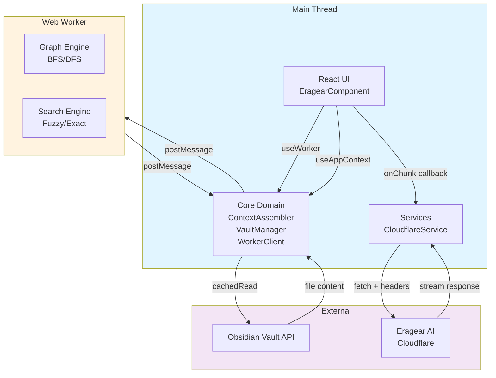

# Hexagonal Architecture Implementation Guide

## Overview

The EraGear Obsidian Copilot plugin has been restructured from a monolithic UI-centric architecture to a **Hexagonal Architecture (Ports & Adapters)** with off-main-thread processing via Web Workers.

### Key Principles

1. **Separation of Concerns**: Clear layers (Domain, Infrastructure, Presentation)
2. **Off-Main-Thread Processing**: Heavy computation in Web Workers
3. **Message-Based Communication**: No direct object passing between Main Thread and Worker
4. **Security Isolation**: Cloudflare credentials encrypted, Worker has no access to Obsidian API
5. **Type Safety**: Full TypeScript with shared interfaces between layers

---

## Architecture Layers

### 1. **Core Domain Logic** (`src/core/`)

This layer contains business logic completely independent of UI framework or external services.

#### Files:

- **`types.ts`**: Shared interfaces for the entire application
  - `GraphNode`, `GraphEdge`: Graph structures
  - `ContextPayload`: AI request payload
  - `WorkerMessage`, `WorkerResponse`: Message protocol
  - `CloudflareConfig`, `PluginSettings`: Configuration

- **`vault-manager.ts`**: Safe Obsidian Vault API wrapper
  - Reads file content, metadata, links, tags
  - Handles file operations safely
  - Only exposes JSON-serializable data to workers
  
  ```typescript
  const vaultManager = createVaultManager(app);
  const fileData = await vaultManager.collectFileData(file);
  ```

- **`worker-client.ts`**: Main Thread bridge to Web Worker
  - Singleton pattern for Worker lifecycle
  - Promise-based async API
  - Request timeout and error recovery
  - Heartbeat for worker health monitoring
  
  ```typescript
  const workerClient = getWorkerClient();
  const graph = await workerClient.analyzeGraph(payload);
  ```

- **`context-assembler.ts`**: Orchestrates data flow
  - Combines VaultManager + WorkerClient results
  - Builds `ContextPayload` for AI API
  - Caches graph results (30s TTL)
  - Provides high-level APIs for UI
  
  ```typescript
  const assembler = createContextAssembler(vaultManager);
  const context = await assembler.assembleContext(filePath, query);
  ```

### 2. **Worker Thread Logic** (`src/workers/`)

Heavy computation runs in separate thread to prevent UI blocking.

#### Files:

- **`context.worker.ts`**: Worker entry point
  - Listens for messages from Main Thread
  - Routes to appropriate engine
  - Sends back JSON results

- **`graph-engine.ts`**: Graph analysis
  - BFS traversal for k-hop neighbors
  - Link resolution (internal links, tags, aliases)
  - Relevance scoring
  - Node deduplication

- **`search-algo.ts`**: Search algorithms
  - Exact string matching
  - Fuzzy matching (Levenshtein distance)
  - BM25-like relevance scoring
  - Multi-file full-text search

#### Message Protocol:

```typescript
// Main Thread sends:
WorkerMessage {
  id: string;           // UUID for tracking
  type: WorkerMessageType;  // 'ANALYZE_GRAPH' | 'SEARCH_CONTENT' | ...
  payload: any;         // Specific payload structure
  timestamp: number;
}

// Worker responds:
WorkerResponse {
  id: string;
  success: boolean;
  data?: any;
  error?: string;
}
```

### 3. **Services Layer** (`src/services/`)

External service communication (infrastructure concerns).

#### Files:

- **`cloudflare-api.ts`**: Eragear Core AI backend
  - Secure HTTPS communication
  - CF-Access headers for authentication
  - Streaming response handling
  - Request/response validation
  
  ```typescript
  const service = createCloudflareService(config);
  await service.streamChat(message, context, onChunk, onError);
  ```

### 4. **Presentation Layer** (`src/ui/`)

React components for user interface.

#### Sub-directories:

- **`views/`**: Container components
  - `ChatPanel`: Main chat interface
  - `TestPanel`: Testing/debugging interface

- **`components/`**: Atomic UI components
  - `ActionCard`: Reusable action button
  - `ConsoleLog`: Output display
  - `TabNavigation`: Tab switcher

- **`hooks/`**: Custom React hooks
  - `useWorker`: Simplified Worker communication
  - Custom hooks for data fetching, state management

- **`context/`**: Global React Context
  - `AppContext`: Global app state (messages, streaming status, selected file)

#### Key Components:

```typescript
// AppContext for global state
<AppContextProvider>
  <EragearComponent>
    <TestPanel />
  </EragearComponent>
</AppContextProvider>

// Hook for worker communication
const { analyzeGraph, searchContent, isReady } = useWorker();

// Hook for global state
const { addMessage, streamingChunks } = useAppContext();
```

---

## Data Flow Diagram



---

## Usage Examples

### 1. Reading Active File and Building Graph

```typescript
// In UI component
const { contextAssembler, vaultManager } = useServices();

const activeFile = vaultManager.getActiveFile();
if (activeFile) {
  const context = await contextAssembler.assembleContext(
    activeFile.path,
    userQuery
  );
  // context includes graph, related notes, file content
}
```

### 2. Searching Vault

```typescript
const results = await contextAssembler.searchVault("my query", 20);
// Returns: Array<{ path, title, excerpt }>
```

### 3. Streaming AI Response

```typescript
const service = createCloudflareService(config);

service.streamChat(
  userMessage,
  context,
  (chunk) => {
    // Called for each chunk
    appContext.addStreamChunk(requestId, chunk.chunk);
  },
  (error) => {
    // Error handling
    appContext.setError(error);
  }
);
```

### 4. Custom Hook in Component

```typescript
function MyComponent() {
  const { analyzeGraph, isReady, graphState } = useWorker();
  const { addMessage, isStreaming } = useAppContext();

  const handleAnalyze = async () => {
    if (!isReady) return;
    
    const result = await analyzeGraph({
      rootFilePath: "path/to/file.md",
      maxHops: 2,
      allFiles: [...],
    });
    
    if (result) {
      addMessage({
        role: 'assistant',
        content: JSON.stringify(result),
        timestamp: Date.now(),
      });
    }
  };

  return (
    <button onClick={handleAnalyze} disabled={!isReady || isStreaming}>
      Analyze
    </button>
  );
}
```

---

## Configuration

Plugin settings are managed in `settings.ts`:

```typescript
interface MyPluginSettings {
  cloudflareAccessId: string;
  cloudflareAccessSecret: string;
  cloudflareApiEndpoint: string;
  maxGraphHops: number;
  searchMaxResults: number;
  debounceDelay: number;
}
```

Settings are loaded/saved by the plugin on startup and persisted via Obsidian's data API.

---

## Worker Initialization

The esbuild configuration (`esbuild.config.mjs`) has been enhanced to support Web Workers:

```javascript
const webWorkerPlugin = {
  name: "web-worker",
  setup(build) {
    // Intercepts .worker.ts imports
    // Bundles them separately as Blobs
    // Allows instantiation: new Worker(blobUrl)
  }
};
```

**Initialization flow**:
1. `main.ts` loads plugin
2. `WorkerClient.getInstance()` creates Worker from bundled code
3. Worker posts `__INIT__` message when ready
4. Main Thread queues messages until worker is ready
5. Messages are flushed once worker initializes

---

## Security Considerations

### 1. **Token Management**
- Cloudflare credentials stored in plugin settings only
- Never exposed in console, logs, or worker thread
- Tokens included in request headers only

### 2. **Worker Isolation**
- Worker cannot access Obsidian API
- Worker receives only JSON-serializable data
- No direct memory access between threads

### 3. **Data Minimization**
- Only necessary file content sent to worker
- Graph results cached locally (30s TTL)
- No raw vault dumps sent to external services

### 4. **Request Validation**
- CloudflareService validates config before requests
- Worker request/response validated via schema
- Timeout handling (30s per request)

---

## Troubleshooting

### Worker Not Initializing

```typescript
// Check worker status
const client = getWorkerClient();
if (!client.getIsReady()) {
  console.warn("Worker not ready, attempting restart...");
  client.restart();
}
```

### Graph Analysis Timeout

If vault is very large (>5000 files), graph analysis may timeout:

```typescript
// Reduce hop count in settings
// Or increase timeout in WorkerClient (REQUEST_TIMEOUT)
const assembler = createContextAssembler(vault, {
  maxGraphHops: 1, // Reduce from 2
});
```

### Cloudflare Connection Issues

Verify configuration in settings:

```typescript
const validation = cloudflareService.validateConfig();
if (!validation.valid) {
  console.error("Missing:", validation.errors);
}
```

---

## Future Enhancements

1. **Streaming Improvements**
   - Implement Server-Sent Events (SSE) instead of fetch polling
   - Add progress indicators for long-running operations

2. **Caching Strategy**
   - Implement IndexedDB for larger cache
   - Persist graph across sessions

3. **Performance Optimization**
   - Lazy-load Worker only when needed
   - Implement request batching for multiple searches

4. **Testing Framework**
   - Unit tests for Graph Engine
   - Integration tests for ContextAssembler
   - E2E tests for UI components

5. **Monitoring & Analytics**
   - Plugin performance metrics
   - Worker execution time tracking
   - Error rate monitoring

---

## File Structure Reference

```
src/
├── main.ts                              # Plugin lifecycle
├── settings.ts                          # Settings UI
├── core/
│   ├── types.ts                         # Shared interfaces
│   ├── vault-manager.ts                 # Obsidian API wrapper
│   ├── worker-client.ts                 # Worker communication
│   ├── context-assembler.ts             # Business logic orchestrator
│   └── index.ts                         # Core exports
├── services/
│   ├── cloudflare-api.ts               # AI backend communication
│   └── index.ts                         # Services exports
├── workers/
│   ├── context.worker.ts               # Worker entry point
│   ├── graph-engine.ts                 # Graph algorithms
│   ├── search-algo.ts                  # Search algorithms
│   └── index.ts                         # Worker exports
└── ui/
    ├── context/
    │   ├── AppContext.tsx              # Global React Context
    │   └── index.ts                    # Context exports
    ├── hooks/
    │   ├── useWorker.ts                # Worker communication hook
    │   └── index.ts                    # Hooks exports
    ├── views/
    │   ├── ChatPanel/                  # Chat interface
    │   └── TestPanel/                  # Testing interface
    ├── components/                      # Atomic UI components
    ├── EragearComponent.tsx             # Root React component
    └── eragear-view.tsx                 # Obsidian view wrapper
```

---

## Migration Guide (for existing code)

If you have existing code that directly uses `VaultHandler`, migrate to the new architecture:

### Old Code:
```typescript
const handler = new VaultHandler(app);
const content = await handler.getNodeContent(file);
const structure = handler.getNoteStructure(file);
```

### New Code:
```typescript
import { createVaultManager } from './core';

const vaultManager = createVaultManager(app);
const content = await vaultManager.getFileContent(file);
const structure = vaultManager.getFileStructure(file);
```

For graph analysis, use ContextAssembler instead of direct calls:

```typescript
import { createContextAssembler } from './core';

const assembler = createContextAssembler(vaultManager);
const context = await assembler.assembleContext(filePath, query);
// Contains: graph, related notes, and more
```

---

Generated: 2025-12-26
Version: 1.0 (Hexagonal Architecture)
